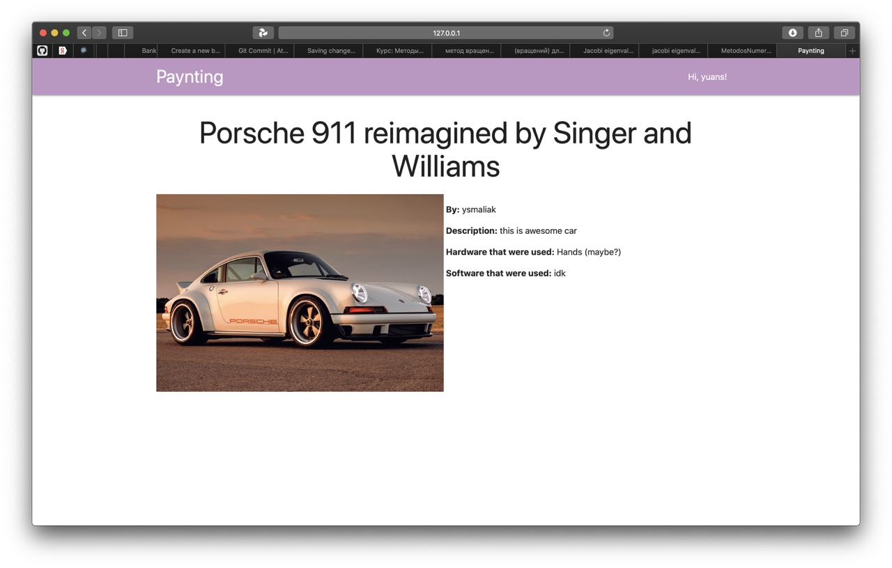
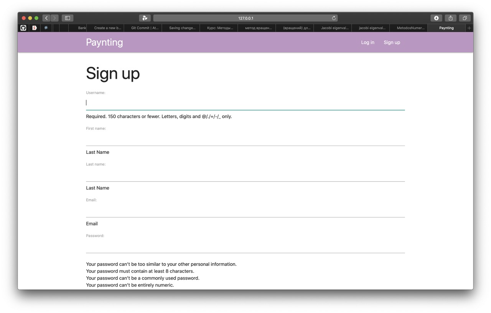
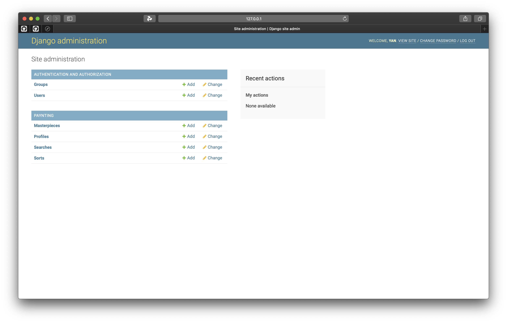
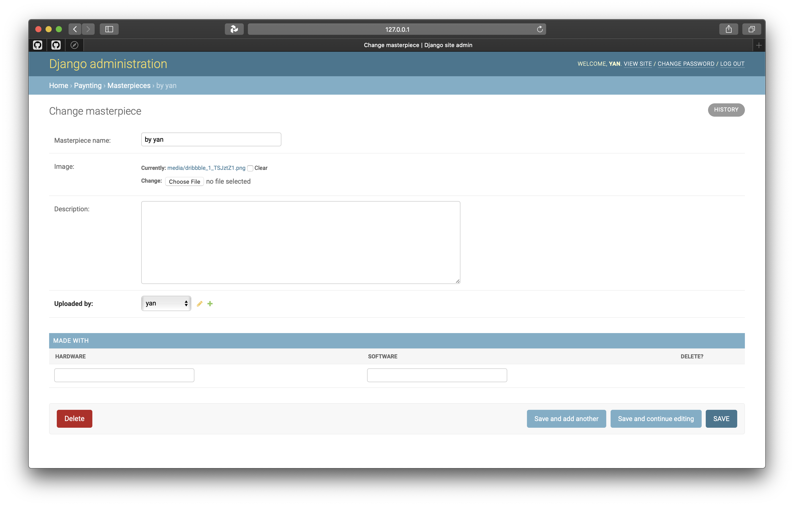

# Paynting

## Description
This is an alternative for [Dribbble.com](https://dribbble.com)  
You can signup and upload your masterpieces to show them to world  
  
  
  

### Models
There are 5 models: Masterpiece, MadeWith, Search, Sort and Profile  
All models in /admin  
  
  


### CRUD
You can create user, view masterpieces, that was uploaded by user, update and delete masterpieces, uploaded by you

### HTTP methods
GET and POST methods used to submit forms  

```html
<form method="POST" enctype="multipart/form-data">
```

```html
<form action="" method="get">
```

## Other
Authentication with django.contrib.auth  
Used database migrations (used PostgreSQL)  
User pytest for testing  
Tests can be ran using command:  
```shell script
pytest
```  
and with coverage:   
```shell script
pytest --cov=paynting
```
